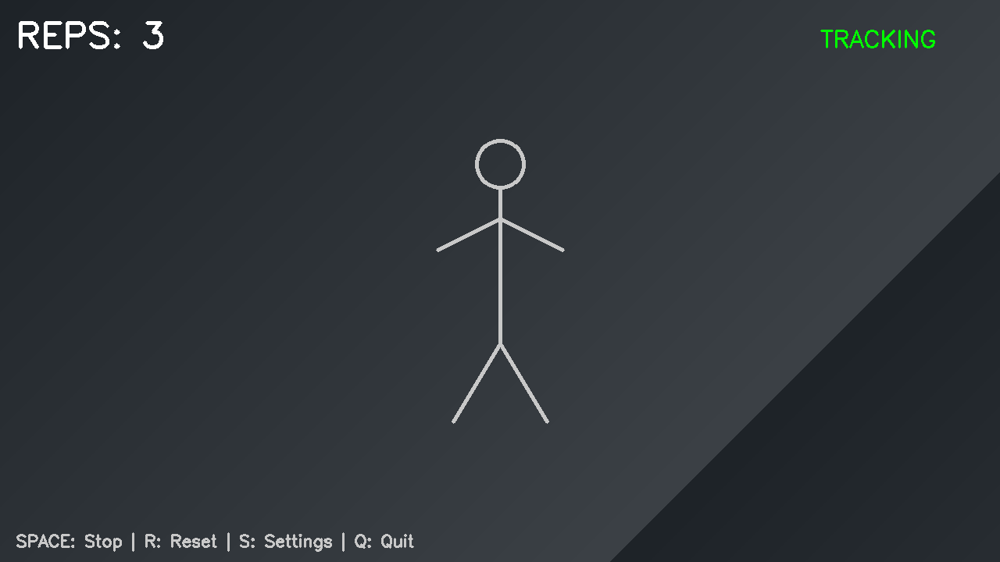
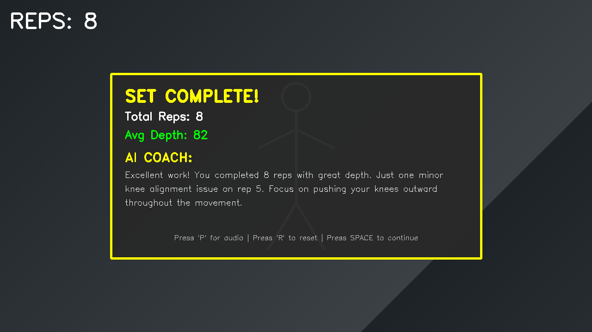

# 🎯 Real-Time Gym Form Correction App (Prototype)

This is a working prototype of a mobile app that gives **real-time form feedback** during gym exercises — using your phone's camera and **on-device AI**.

## ✅ What It Does

- 📷 **Pose Detection**: Uses your phone's camera and MediaPipe to detect your full-body position in real time
- 🧠 **Form Analysis**: Tracks your reps, joint angles, and movement patterns during squats
- 🔊 **Audio Cues**: Plays short voice prompts ("Knees out", "Chest up") **without interrupting your music** (Spotify, Apple Music, etc.)
- 🪄 **AI Coaching**: After each set, an AI assistant gives you a natural-language summary of how you performed

## 💡 Why It Matters

Most "AI fitness" apps only analyze your workout **after** you finish — we're building one that *corrects your form while you're lifting.*

This helps:
- Prevent injuries
- Reinforce good technique
- Coach beginners without needing a human trainer

## ⚙️ Tech Stack

- **Pose Estimation**: MediaPipe BlazePose (33-point skeleton)
- **Angle + Rep Logic**: Custom squat state machine (Python/Java/Kotlin)
- **Audio Cues**: Ducking audio focus (Android/iOS friendly)
- **LLM Integration**: GPT-4 (OpenAI API) for coaching summaries
- **Prototype Target**: Android device (Pixel, Samsung, etc.)

## 🛠️ Status

- ✅ Live camera feed + skeleton overlay
- ✅ Real-time rep detection
- ✅ Form feedback + audio prompts
- ✅ Enhanced UI with animations and settings
- ✅ Set summary screen with AI coaching
- 🔜 Add fatigue detection + AI personalization

## 📦 Installation

### Prerequisites

- Python 3.8 or higher
- pip (Python package manager)
- Webcam or mobile device with camera
- OpenAI API key (for AI coaching feature)

### Setup

1. Clone the repository:
```bash
git clone https://github.com/namitzz/posture.git
cd posture
```

2. Install dependencies:
```bash
pip install -r requirements.txt
```

3. Set up your OpenAI API key:
```bash
export OPENAI_API_KEY='your-api-key-here'
```

Or create a `.env` file:
```
OPENAI_API_KEY=your-api-key-here
```

## 🚀 Usage

### Desktop Demo (Webcam)

Run the main application:
```bash
python src/main.py
```

This will:
1. Open your webcam feed
2. Detect your pose in real-time
3. Track squat reps and form
4. Provide audio feedback
5. Generate AI coaching after each set

### Controls

- **Space**: Start/Stop tracking
- **R**: Reset rep counter
- **P**: Play AI coaching summary (after set)
- **S**: Toggle settings screen
- **Arrow Keys**: Navigate settings menu
- **Enter**: Toggle selected setting
- **Q**: Quit application

### New Features

#### Enhanced UI
- **Dark Mode**: Professional dark theme throughout
- **Animated Cues**: Real-time form feedback with fade-in/fade-out animations
- **Set Summary**: Slide-in panel showing rep stats and AI coaching
- **Settings Menu**: Interactive controls for all features

#### Settings Control
Press **S** to access settings and toggle:
- Skeleton overlay visibility
- Audio cues on/off
- AI coaching on/off
- Debug mode (shows angles)

## 📁 Project Structure

```
posture/
├── src/
│   ├── main.py                 # Main application entry point
│   ├── pose_detector.py        # MediaPipe pose detection
│   ├── squat_analyzer.py       # Squat form analysis and rep counting
│   ├── audio_cues.py           # Audio feedback system
│   ├── ai_coach.py             # OpenAI integration for coaching
│   └── utils.py                # Utility functions
├── assets/
│   └── audio/                  # Audio cue files
├── tests/
│   └── test_squat_analyzer.py  # Unit tests
├── requirements.txt            # Python dependencies
├── .gitignore                  # Git ignore file
└── README.md                   # This file
```

## 🧪 Testing

Run the test suite:
```bash
python -m pytest tests/
```

## 📸 Screenshots

See the UI in action! Check out our [comprehensive screenshot gallery](docs/screenshots/) showing:
- Real-time tracking interface with rep counter
- Color-coded form feedback cues (good/warning/critical)
- AI-powered set summary with coaching insights
- Interactive settings menu
- All UI states and features

Quick preview:


*Real-time tracking with skeleton overlay and rep counter*


*AI coaching summary after completing a set*

View all screenshots in the [docs/screenshots/](docs/screenshots/) directory.

## 📹 Demo (Coming Soon)

Short demo clip showing:
1. Background music playing
2. Live squats on camera
3. "Knees out" cue mid-rep
4. Music volume dips briefly
5. Post-set coaching insight

## 📈 Next Steps

- Add deadlift + bench press modules
- Train personalized rep quality model
- Build early waitlist / pilot with real gym users
- Mobile app development (Android/iOS)
- Cloud deployment for AI coaching

## 🤝 Looking For

- Gym-goers to beta test
- Fitness coaches to advise on form rules
- Investors who believe in AI + strength training

## 📄 License

MIT License - see LICENSE file for details

## 🙏 Acknowledgments

- MediaPipe team for pose detection
- OpenAI for GPT-4 API
- Fitness community for form guidelines

---

**Note**: This is a prototype. For production use, additional safety features and professional fitness consultation are recommended.