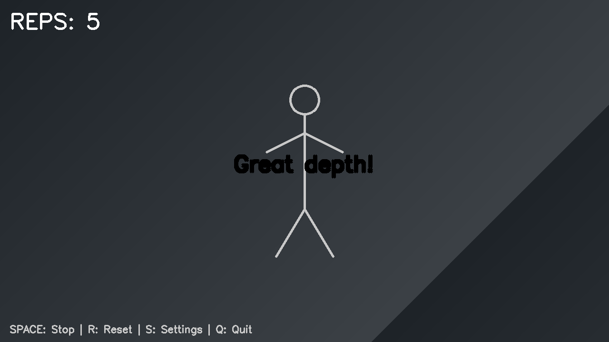
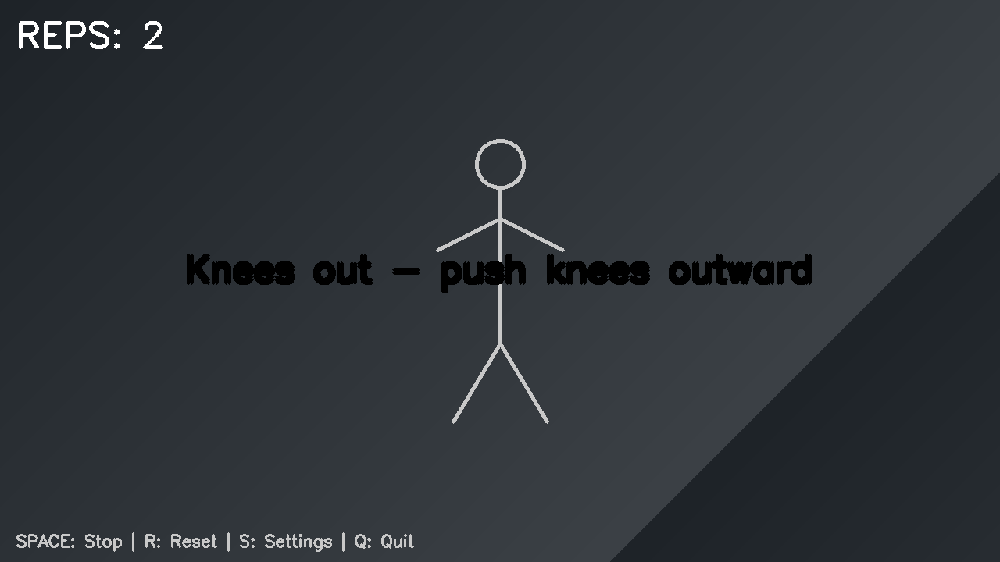
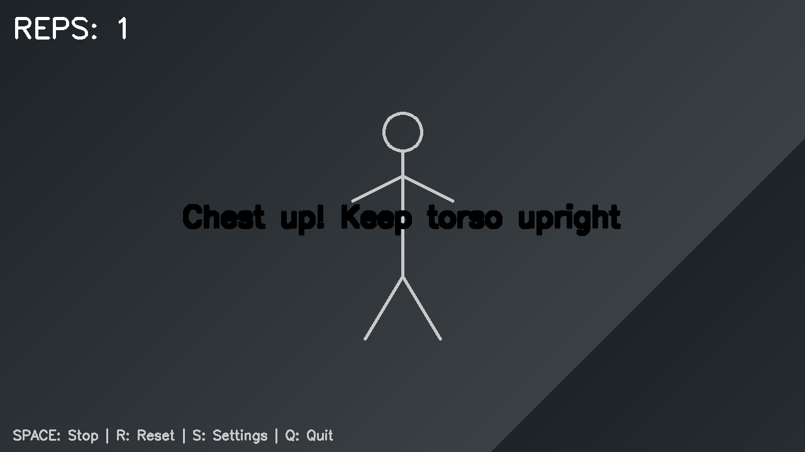
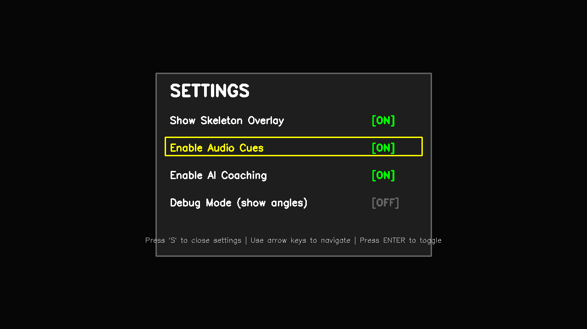
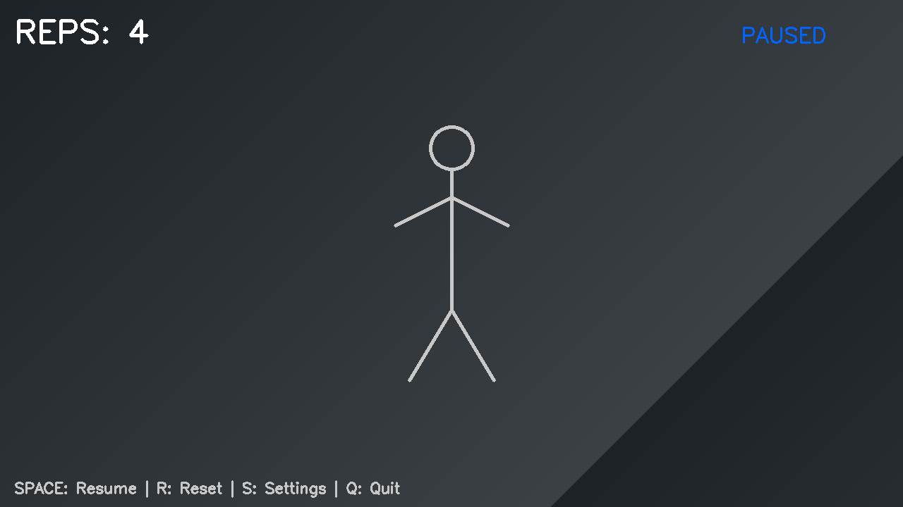

# UI Screenshots

This directory contains screenshots of the Real-Time Gym Form Correction App UI components.

## Screenshots Overview

### 1. Tracking View (`01_tracking_view.png`)
The main tracking interface showing:
- Live rep counter (top-left)
- Tracking status indicator (top-right)
- Stick figure skeleton overlay
- Keyboard controls help text (bottom)


### 2. Good Form Cue (`02_cue_good_form.png`)
Positive feedback display:
- Green colored cue text
- Semi-transparent background
- Fade-in/fade-out animation support
- Example: "Great depth!"



### 3. Warning Cue (`03_cue_warning.png`)
Form correction feedback:
- Orange colored warning text
- Centered display for visibility during exercise
- Example: "Knees out - push knees outward"



### 4. Bad Form Cue (`04_cue_bad_form.png`)
Critical form issue alert:
- Red colored alert text
- High visibility for important corrections
- Example: "Chest up! Keep torso upright"



### 5. Set Summary Screen (`05_set_summary.png`)
Post-set analysis and AI coaching:
- Total reps completed
- Average squat depth angle
- AI-generated coaching feedback
- Slide-in animation from bottom
- Action hints (Press P for audio, R to reset)


### 6. Settings Screen (`06_settings_screen.png`)
Interactive settings menu:
- Toggle controls for all features
- Keyboard navigation (arrow keys)
- Options include:
  - Show Skeleton Overlay
  - Enable Audio Cues
  - Enable AI Coaching
  - Debug Mode
- Cyan highlighting for selected option
- Green [ON] / Gray [OFF] indicators



### 7. Paused State (`07_paused_state.png`)
Application in paused state:
- Orange "PAUSED" status indicator
- All tracking frozen
- Help text updated to show "Resume"



## UI Features Demonstrated

### Color-Coded Feedback
- **Green**: Good form, positive reinforcement
- **Orange**: Minor corrections needed, warnings
- **Red**: Critical form issues requiring immediate attention
- **Cyan**: UI accents, highlights, and interactive elements

### Keyboard Controls
- **SPACE**: Start/Stop tracking
- **R**: Reset rep counter
- **P**: Play AI coaching audio
- **S**: Toggle settings screen
- **Arrow Keys**: Navigate settings menu
- **Enter**: Toggle selected setting
- **Q**: Quit application

### Animation Effects
- **Cue Display**: Fade-in (200ms), hold, fade-out (300ms)
- **Set Summary**: Smooth slide-in from bottom with cubic easing
- **Real-time Updates**: Rep counter and status indicators

### Design Elements
- **Dark Mode**: Professional dark theme throughout
- **Semi-transparent Overlays**: Maintain visibility of video feed
- **Large Text**: Readable during exercise from distance
- **Minimalist Layout**: Focus on essential information

## Technical Details

All screenshots are generated using OpenCV and demonstrate the actual UI components from the application. The screenshots use simulated video frames with stick figures to represent pose detection without requiring a camera or real-time video feed.

### Screenshot Generation

Screenshots can be regenerated by running:
```bash
python generate_screenshots.py
```

This will create all screenshots in the `docs/screenshots/` directory.

## Use Cases

These screenshots are useful for:
- **Documentation**: Visual guide for users
- **Development**: Reference for UI improvements
- **Presentations**: Showcase the app's features
- **Testing**: Visual regression testing baseline
- **Marketing**: Demonstrate app capabilities
